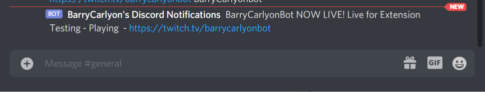

# What is this

This repo contains the code for [https://twitch.discord.barrycarlyon.co.uk](https://twitch.discord.barrycarlyon.co.uk), a Twitch Go Live Notification System for Discord

## Languages

It's written in NodeJS

## Documentation

It uses the following API reference documentation

- [Twitch OAuth authorization code flow](https://dev.twitch.tv/docs/authentication/getting-tokens-oauth#oauth-authorization-code-flow) for Authentication
- [Twitch Eventsub](https://dev.twitch.tv/docs/eventsub) for Channel/Stream Notifications
- [Discord oAuth2](https://discord.com/developers/docs/topics/oauth2) for Discord webhook Setup and Login
- [Discord Webhooks](https://discord.com/developers/docs/resources/webhook) for talking to Webhooks

## What does it look like?



## Running it yourself

This system uses MySQL as a Database backend and Redis for session handling and message brokering between the two services

- Import `sql/barrys_discord_twitch.sql`

- Copy `config_sample.json` to `config.json`
- Revise the settings within, for your Discord Application and Twitch Applications.
- Revise that database access settings
- Make sure to update the URLs, and Twitch EventSub
- npm install

It's expected to your [PM2](https://pm2.keymetrics.io/) as a process manager. So you can either use PM2 or run the two jobs another way

- pm2 start app.json

or start the two jobs manually

- node server.js
- node utils/runner.js

## License

This project is Licensed under DO WHAT THE FUCK YOU WANT
Image/logo assets remain the property/licensing of their resepective owners

## OMGLIEKWUT OHMYGOODNESS U SO MUCH HELP

Thank you for the help I want to give you beer/coffee money -> Check the Funding/Sponsor details

## Nginx and Cookie Security

This is an example, so doesn't contain all the _best_ security practices.
Since this uses cookies to manage logins you should change the session code to something like

```
app.use(session({
    store: new RedisStore({
        client: redis_client
    }),
    secret,
    resave: true,
    saveUninitialized: false,
    cookie: {
        secure: true,
        httpOnly: true,
        domain: 'twitch.discord.barrycarlyon.co.uk',
        expires: new Date(Date.now() + 60 * 60 * 1000)
    },
    rolling: true
}));
```

Change the domain as needed!

See also [Production Best Practices: Security](https://expressjs.com/en/advanced/best-practice-security.html#use-cookies-securely)

If you are putting this nodeJS HTTP server beind NGINX, your NGINX declartion for the location will need additional fields:

```
server {
    listen IPv4:443;
    listen [::]:443;

    server_name example.com;
    root /some/path/to/files;

    ssl on;
    ssl_certificate /etc/letsencrypt/live/example.com/fullchain.pem;
    ssl_certificate_key /etc/letsencrypt/live/example.com/privkey.pem;

    location / {
        # Cookie Flags
        proxy_set_header X-Real-IP $remote_addr;
        proxy_set_header X-Forwarded-For $proxy_add_x_forwarded_for;
        proxy_set_header X-Forwarded-Proto $scheme;
        # Cookie Flags
        proxy_set_header Host $http_host;
        proxy_set_header X-NginX-Proxy true;
        # Other

        proxy_set_header Upgrade $http_upgrade;
        proxy_set_header Connection "upgrade";
        proxy_http_version 1.1;
        proxy_set_header X-Forwarded-For $proxy_add_x_forwarded_for;
        proxy_set_header Host $host;

        proxy_pass http://this_server_relay;
    }
}

upstream this_server_relay {
    server 127.0.0.1:5000;
    keepalive 8;
}

```
